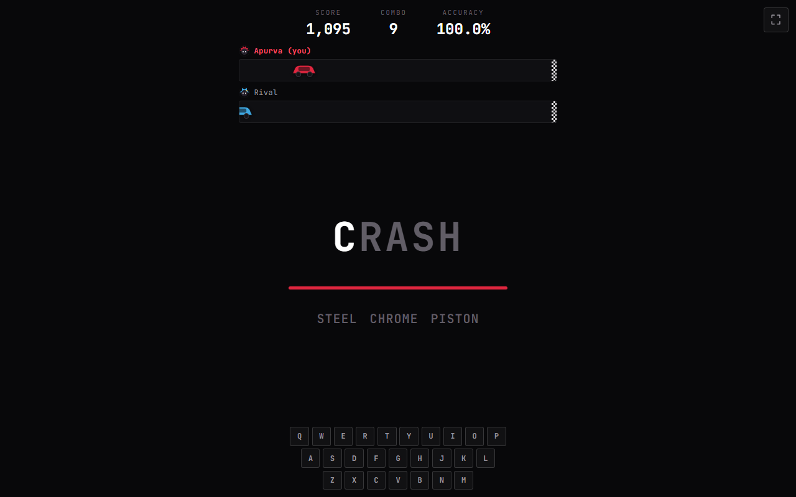
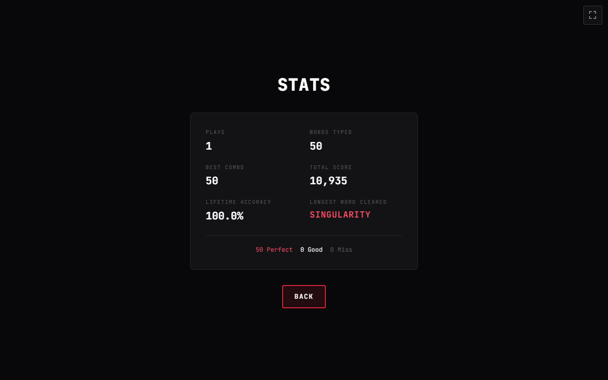
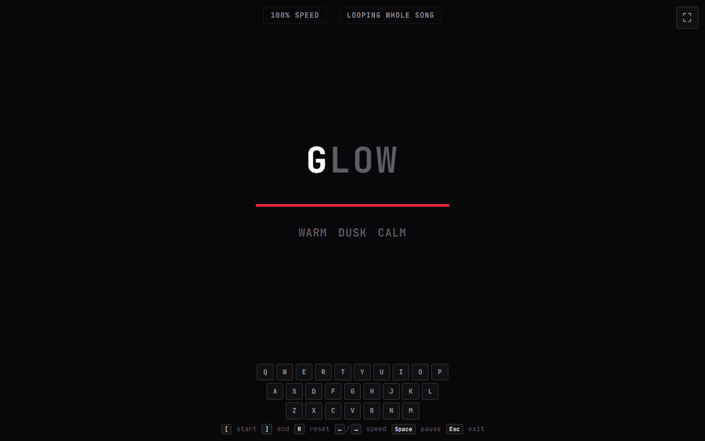
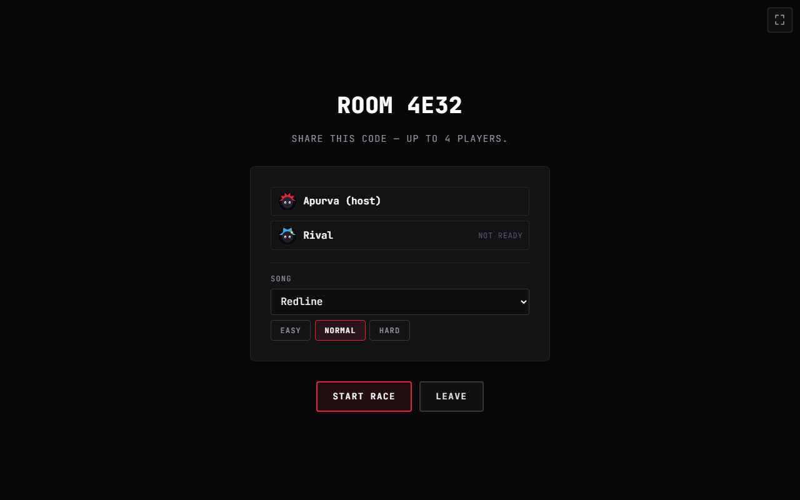
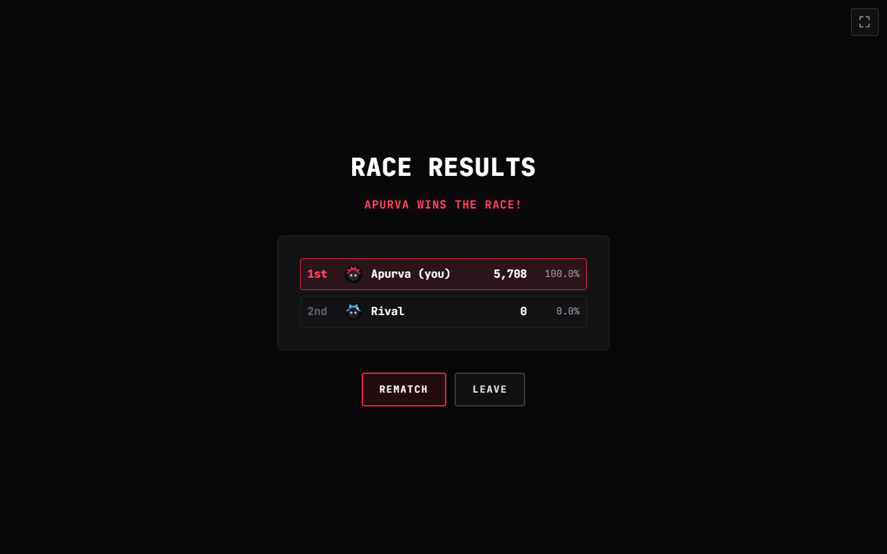

# KeyStrike

### The Battle Begins

A browser typing-rhythm game. By Apurva.

<p align="center">
  
</p>

<p align="center">
  
  
  
  
  
  
</p>

One word at a time, centered on screen, with a shrinking timer underneath —
type it before the clock runs out. Finish before the deadline for a
**Perfect**, just after for a **Good**; run out the clock and it's a **Miss**.
Every song is synthesized live in the browser via the Web Audio API — no
external audio files, nothing to license.

**Play it:** not deployed yet — clone and run it locally for now (see
[Development](#development) below).

## Showcase

<table>
<tr>
<td width="50%">
  
  <p align="center"><sub><b>Loader</b> — animated keyboard, By Apurva</sub></p>
</td>
<td width="50%">
  
  <p align="center"><sub><b>Home</b></sub></p>
</td>
</tr>
<tr>
<td width="50%">
  
  <p align="center"><sub><b>Song Select</b> — 5 songs, 3 difficulties each</sub></p>
</td>
<td width="50%">
  
  <p align="center"><sub><b>Gameplay</b> — type the word, beat the clock</sub></p>
</td>
</tr>
<tr>
<td width="50%">
  
  <p align="center"><sub><b>Results</b> — grade, score, hit breakdown</sub></p>
</td>
<td width="50%">
  
  <p align="center"><sub><b>Settings</b> — speed, text size, accessibility</sub></p>
</td>
</tr>
<tr>
<td width="50%">
  
  <p align="center"><sub><b>Stats</b> — lifetime totals</sub></p>
</td>
<td width="50%">
  
  <p align="center"><sub><b>Practice</b> — loop a section, adjust speed</sub></p>
</td>
</tr>
<tr>
<td width="50%">
  
  <p align="center"><sub><b>Battle Room</b> — up to 4 players, no login</sub></p>
</td>
<td width="50%">
  
  <p align="center"><sub><b>Battle Results</b> — first past the post wins</sub></p>
</td>
</tr>
</table>

## How to play

Type each word before its timer runs out. Every correct next letter locks
in; wrong ones are simply ignored — no penalty, same forgiveness as an
ordinary typing test.

- **Perfect** — finished at or before the deadline
- **Good** — finished just after, within a short grace period
- **Miss** — the grace period ran out unfinished; breaks your combo
- `Esc` — pause / resume (solo and Practice only — Battle has no pause)

Combo builds a score multiplier as you chain hits, and longer words are
worth more. Five original songs are included (each with its own hand-curated
word bank), every one playable at **Easy**, **Normal**, or **Hard** — Easy
uses shorter words with more time between them, Hard is the opposite. Best
score per song+difficulty and lifetime stats (words typed, best combo,
longest word ever cleared) are saved locally in your browser.

## Battle mode (4 players, no login)

Create a room, get a 4-character code, share it — up to three friends join
by typing it in. No accounts, nothing to remember. The host picks a song and
difficulty and starts the race.

Progress is shown as a **car race**: each player's car advances along the
track as they type, sped up by combo the same way scoring is — a hot streak
visibly pulls your car ahead. **First car to the finish line wins**, even if
the song is still playing for everyone else. Ranked results show everyone's
score and accuracy once the race ends.

The interesting design constraint: syncing every keystroke over the network
would be both slow and unfair, so **each client stays authoritative for its
own run** — the same local engine as solo play, same local judging. The
server ([`server/`](server/)) only relays room membership, a synchronized
start signal, and a periodic progress snapshot from each player so everyone
sees everyone else live. See [`server/README.md`](server/README.md) for
running or deploying it.

## Everything else

- **Practice mode** — loop any section of a song (`[` / `]` to mark it,
  `R` to clear), scrub speed 25%–200% with `←` `→`. No score kept; it's for
  learning a hard passage, not grading it.
- **Accessibility** — Settings has a Game Speed slider (more time per word),
  a text-size slider, a colorblind-safe amber palette (swaps out red, which
  is otherwise the app's only accent), and an in-app Reduce Motion toggle
  that supplements the OS-level setting.
- **Mobile** — typing needs a keyboard, so on a touch device a "Tap to
  Start" screen opens your device's on-screen keyboard via a focused hidden
  input, rather than blocking play outright.
- **Installable PWA** — offline-capable; add it to your home screen or
  desktop dock.
- **Fullscreen toggle** — top-right corner, on every screen.

## Development

Requires Node 18+.

```bash
npm install
npm run dev       # start the dev server
npm run build     # type-check and build a production bundle to dist/
npm run preview   # serve the production build locally
npm run test      # run the unit tests
npm run lint      # lint the project
```

Battle mode needs its relay server running too — see
[`server/README.md`](server/README.md) (`cd server && npm install && npm start`,
then the frontend's `VITE_BATTLE_SERVER_URL` points at it, defaulting to
`http://localhost:8787` in dev).

## How the music works

Each song in `src/data/songs/` is an original word bank plus a chord
progression (see `src/engine/songBuilder.ts`), which `buildWordSong`
expands into three difficulty charts (word choice and spacing vary by
difficulty) and a synthesized backing track — bass, a soft pad, and hats,
played through oscillators and noise bursts in `src/engine/audioEngine.ts`.
Word-completion sounds are short reactive chimes played live rather than
pre-scheduled, since the three difficulties don't share one timeline to bake
sounds into ahead of time.

## Project structure

```
src/
├── components/     shared UI (AnimatedKeyboard, Avatar, RaceTrack, Slider, FullscreenButton)
├── screens/        one folder per screen — solo, practice, and battle all live here
├── engine/         word-judging logic, audio synthesis, song building/scaling
├── multiplayer/    RoomClient (socket.io-client wrapper) and shared room types
├── data/songs/     the five song definitions (word banks + chord progressions)
├── utils/          localStorage-backed settings, high scores, and lifetime stats
├── types/          shared TypeScript types
└── styles/         theme tokens and global styles

server/             the battle relay — see server/README.md
```

## License

MIT — see [LICENSE](LICENSE).
