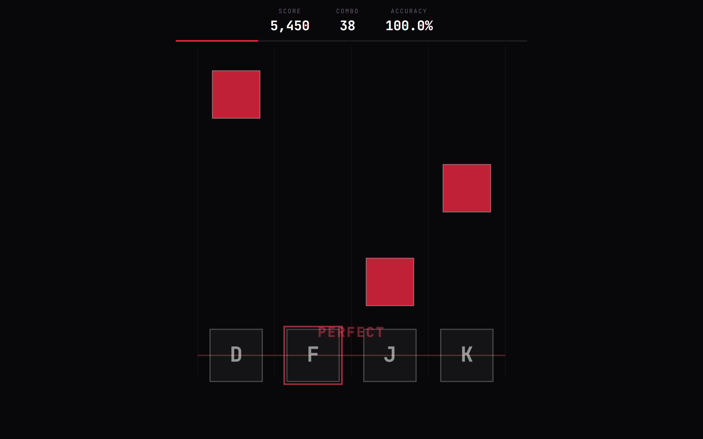
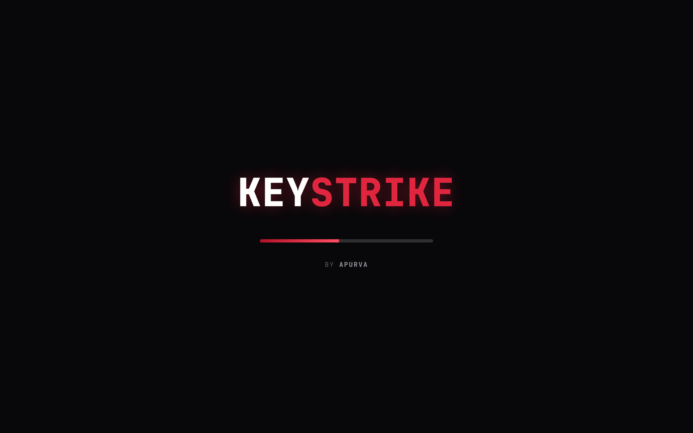
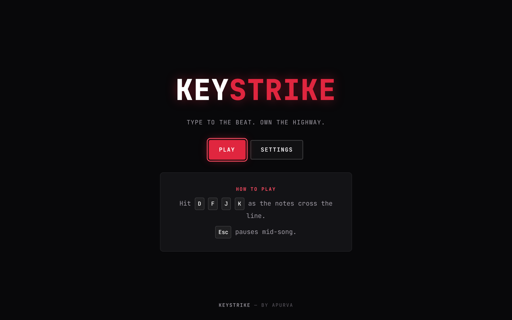
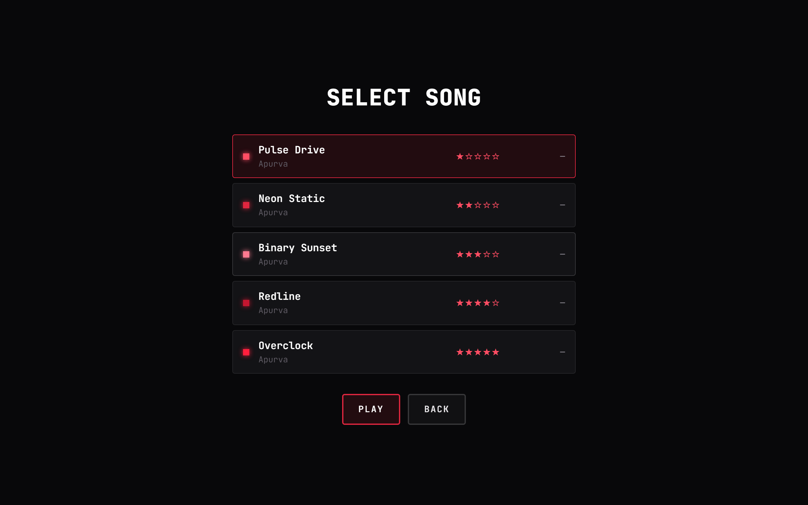
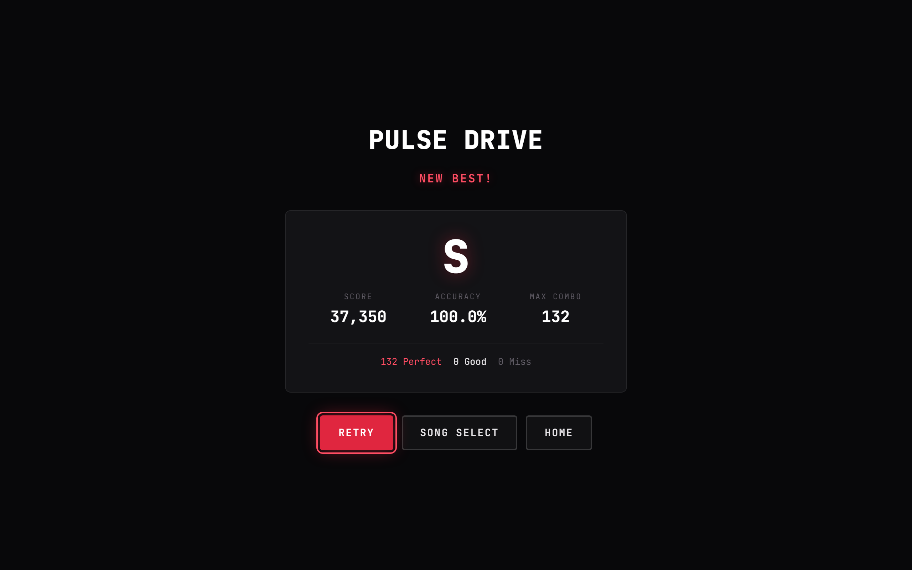
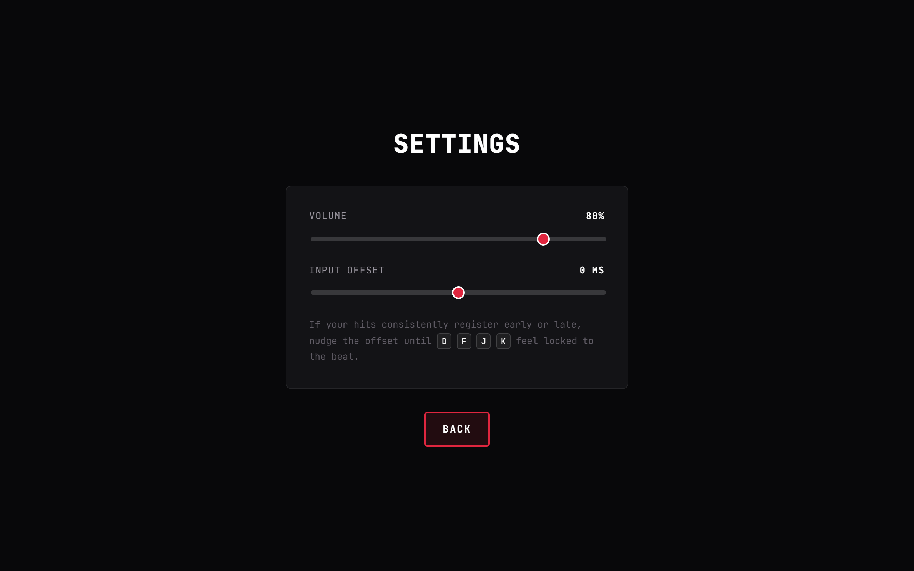

# KeyStrike

A browser rhythm-typing game. By Apurva.

<p align="center">
  
</p>

<p align="center">
  
  
  
  
</p>

Notes fall down four lanes in time with the music — hit `D` `F` `J` `K` as
they cross the line. Built with React, TypeScript, and the Web Audio API;
every song is synthesized live from composed note data, so there are no
external audio files or licensing to worry about.

**Play it:** not deployed yet — clone and run it locally for now (see
[Development](#development) below).

## Showcase

<table>
<tr>
<td width="50%">
  
  <p align="center"><sub><b>Loader</b> — By Apurva</sub></p>
</td>
<td width="50%">
  
  <p align="center"><sub><b>Home</b></sub></p>
</td>
</tr>
<tr>
<td width="50%">
  
  <p align="center"><sub><b>Song Select</b> — five original tracks</sub></p>
</td>
<td width="50%">
  
  <p align="center"><sub><b>Gameplay</b> — live combo &amp; judgements</sub></p>
</td>
</tr>
<tr>
<td width="50%">
  
  <p align="center"><sub><b>Results</b> — grade, score, hit breakdown</sub></p>
</td>
<td width="50%">
  
  <p align="center"><sub><b>Settings</b> — volume &amp; input offset</sub></p>
</td>
</tr>
</table>

## How to play

- `D` `F` `J` `K` — hit the four lanes
- `Esc` — pause / resume
- Timing windows: **Perfect** and **Good**; missed notes break your combo
- Combo builds a score multiplier as you chain hits

Five songs are included, ranging from a slow warm-up to a fast, dense
finisher. Best score and accuracy per song are saved locally in your browser.

## Development

Requires Node 18+.

```bash
npm install
npm run dev       # start the dev server
npm run build     # type-check and build a production bundle to dist/
npm run preview   # serve the production build locally
npm run test      # run the unit tests
npm run lint      # lint the project
```

## How the music works

Each song in `src/data/songs/` is authored as a short chord progression and a
one- or two-bar melodic motif (see `src/engine/songBuilder.ts`), expanded into
a full note sequence and synthesized through oscillators and noise bursts in
`src/engine/audioEngine.ts`. The gameplay chart (which lane lights up, and
when) is generated from the exact same note data as the audio, so the two can
never drift out of sync.

## Project structure

```
src/
├── components/   shared UI pieces (Slider, etc.)
├── screens/      one folder per screen (Loader, Home, SongSelect, Gameplay, Results, Settings)
├── engine/       audio synthesis, chart/scoring logic, canvas rendering, input mapping
├── data/songs/   the five song definitions
├── utils/        localStorage-backed settings and high scores
├── types/        shared TypeScript types
└── styles/       theme tokens and global styles
```

## License

MIT — see [LICENSE](LICENSE).
# KeyStrike-The-Battle-Begins
